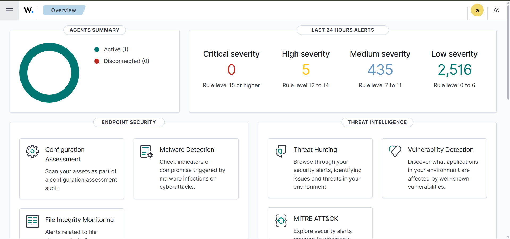
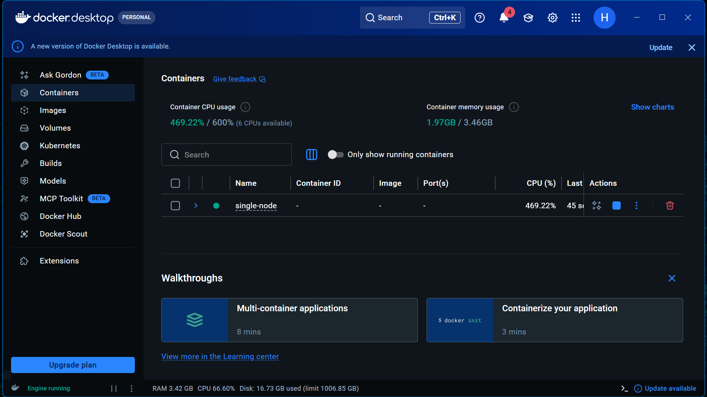
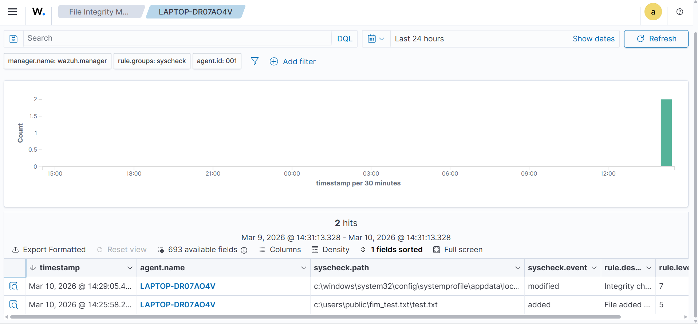
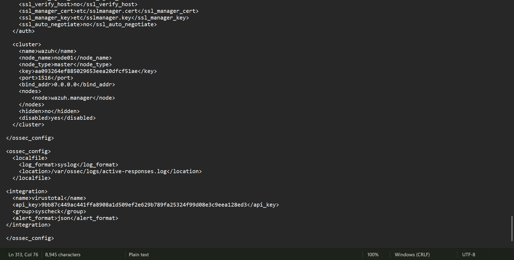
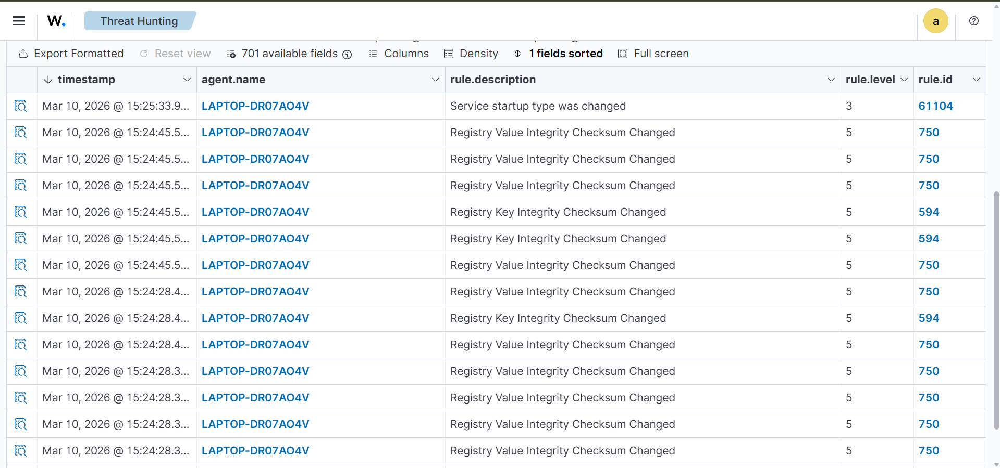
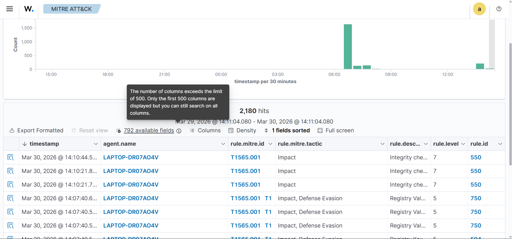
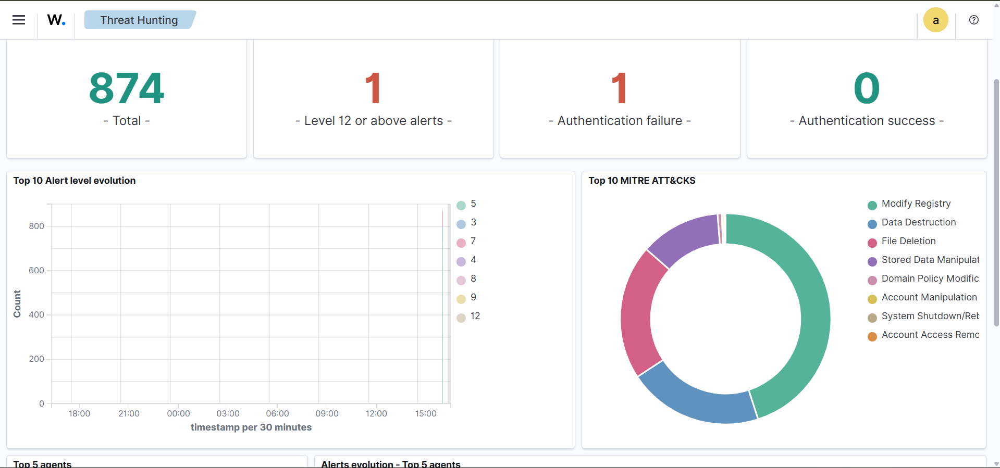

#  Wazuh Threat Detection & Response Lab
Advanced Wazuh-based threat detection and response lab with File Integrity Monitoring (FIM), VirusTotal, AlienVault OTX, MITRE ATT&amp;CK mapping, and automated active response.
# 🔐 Wazuh Threat Detection & Response Lab

## Overview

This project demonstrates an advanced endpoint security monitoring system using Wazuh. It integrates multiple security capabilities including File Integrity Monitoring (FIM), VirusTotal, AlienVault OTX, MITRE ATT&CK mapping, and Active Response to detect, analyze, and respond to threats in real time.

The project simulates a real-world Security Operations Center (SOC) environment by combining detection, threat intelligence, and automated response mechanisms.

---

##  Environment Clarification

This project was initially implemented and documented using a Kali Linux environment.

For demonstration and testing purposes, the same setup was later replicated on a Windows system using Docker. All screenshots included in this repository are captured from the Windows environment.

Both setups follow the same architecture and configurations, ensuring consistent functionality across environments.

---

##  Features

* 📁 File Integrity Monitoring (FIM)
* 🦠 VirusTotal Integration (Malware Detection)
* 🌐 AlienVault OTX Integration (Threat Intelligence)
* 🎯 MITRE ATT&CK Mapping
* ⚡ Active Response Automation

---

## 🏗️ Architecture

The system follows a centralized monitoring architecture:

* Wazuh Agent collects endpoint data
* Wazuh Manager analyzes and detects threats
* Alerts are enriched using threat intelligence
* Active Response mitigates attacks automatically
* Results are visualized in the Wazuh Dashboard
  
  

---

## ⚙️ Setup (Windows + Docker)

```bash
git clone https://github.com/wazuh/wazuh-docker.git -b v4.14.0
cd wazuh-docker/single-node/
docker compose up -d
```


---

## 📁 File Integrity Monitoring (FIM)

Detects unauthorized file and registry changes on the endpoint system.



---

## 🦠 VirusTotal Integration

Scans file hashes against VirusTotal to detect malicious files.



---

## 🌐 AlienVault OTX Integration

Checks IPs and domains against global threat intelligence feeds.



---

## 🎯 MITRE ATT&CK Mapping

Maps detected events to attacker tactics and techniques.



---

## ⚡ Active Response

Automatically blocks malicious activity using predefined rules.



---

## 🚨 Use Cases

* Malware detection using EICAR test file
* File and registry tampering detection
* Malicious IP detection using OTX
* Suspicious activity monitoring

---

## 🛠️ Tools & Technologies Used

* Wazuh
* Docker
* Windows 10/11
* VirusTotal API
* AlienVault OTX API

---

## 📚 What I Learned

* How to deploy and configure Wazuh in different environments
* Hands-on experience with SIEM and endpoint security monitoring
* Integration of external threat intelligence (VirusTotal & OTX)
* Understanding of MITRE ATT&CK framework and attack mapping
* Implementation of File Integrity Monitoring (FIM)
* Automating incident response using Active Response
* Simulating real-world attack scenarios and analyzing alerts
* Troubleshooting deployment and integration issues

---

##  Results

* Achieved real-time threat detection and monitoring
* Improved alert accuracy using threat intelligence
* Automated response reduced manual intervention
* Successfully simulated multiple attack scenarios

---

## 📄 Report

[Download Full Report](report/wazuh_project_report.pdf)

---
